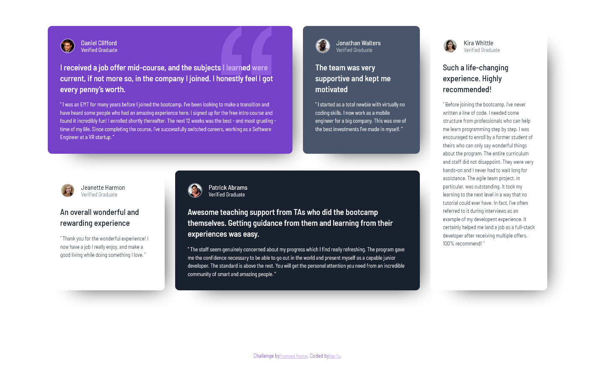

# Frontend Mentor - Testimonials grid section solution

This is a solution to the [Testimonials grid section challenge on Frontend Mentor](https://www.frontendmentor.io/challenges/testimonials-grid-section-Nnw6J7Un7). Frontend Mentor challenges help you improve your coding skills by building realistic projects.

## Table of contents

- [Overview](#overview)
  - [The challenge](#the-challenge)
  - [Screenshot](#screenshot)
  - [Links](#links)
- [My process](#my-process)
  - [Built with](#built-with)
  - [What I learned](#what-i-learned)
  - [Useful resources](#useful-resources)
- [Author](#author)

**Note: Delete this note and update the table of contents based on what sections you keep.**

## Overview

### The challenge

Users should be able to:

- View the optimal layout for the site depending on their device's screen size

### Screenshot

### Links

- Solution URL: [Github](https://github.com/imvan2/testimonials-grid-section)
- Live Site URL: [Live](https://imvan2.github.io/testimonials-grid-section/)

## My process

### Built with

- Semantic HTML5 markup
- SCSS/SASS
- CSS custom properties
- Flexbox
- CSS Grid
- Mobile-first workflow

### What I learned

Solidified my understanding of CSS Grid and how amazing it is!

### Useful resources

- [SCSS/SASS](https://sass-lang.com/guide/#inheritance) - This helped me for SCSS/SASS.
- [CSS Grid](https://css-tricks.com/snippets/css/complete-guide-grid/#prop-justify-items) - This helped me understand CSS Grid.

## Author

- LinkedIn - [Van Tu](https://www.linkedin.com/feed/)
- Frontend Mentor - [@imvan2](https://www.frontendmentor.io/profile/imvan2)
